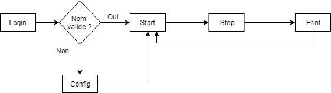

# Projet d'applications mobiles - Tracker GPS

## 1) Archi

---

**LOGIN:**
- EditText login
- si login valide, afficher START
- sinon afficher CONFIG avec le nouveau login entré par défaut

**START:**
- Button lancer le parcours, afficher STOP

**STOP:**
- Button fin du parcours

**PRINT:**
- TextView vitesse moyenne, temps écoulé, vitesse max, localisations GPS
- Placer les localisations GPS sur Google Maps
- Button retour vers START

---

## 2) Améliorations

- Stocker l'historique des courses, les afficher, moyennes sur plusieurs courses, progression, graphes ?
- Affichage des résultats des autres ? --> Palmarès

**CONFIG:**
- Autres infos : longueur de la foulée (pour avoir le nombre de pas final), mot de passe...

**STOP:**
- Infos en cours à afficher : temps écoulé, vitesse moyenne, dernière localisation GPS, messages d'encouragement...
- Pouvoir mettre en pause le parcours
